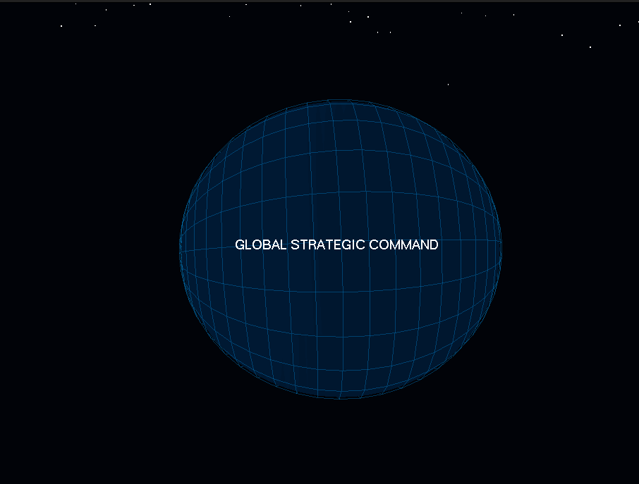
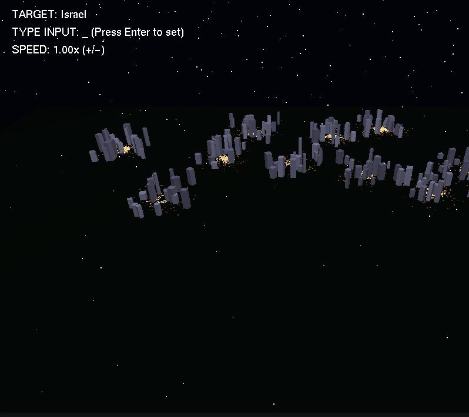
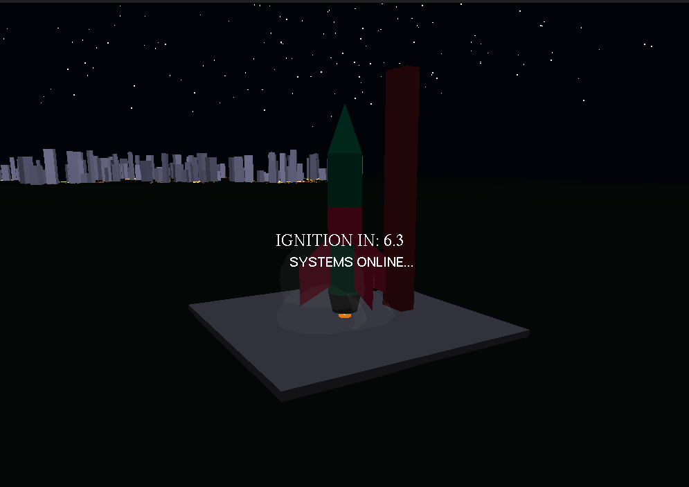
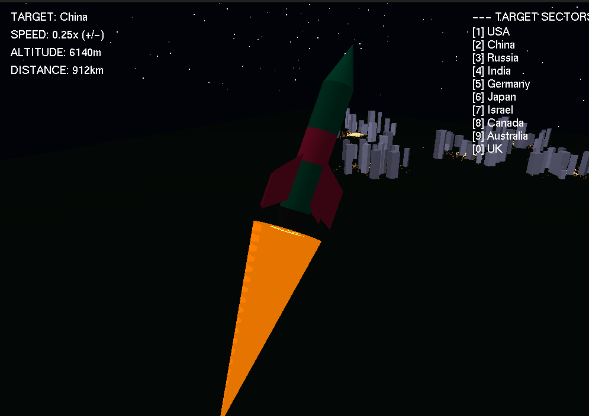
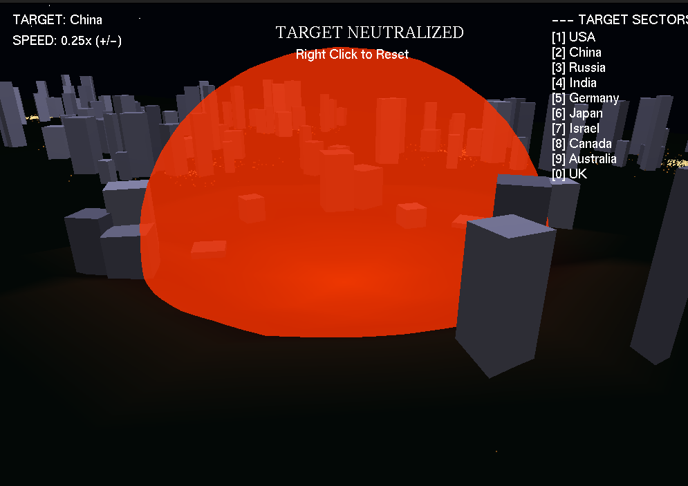
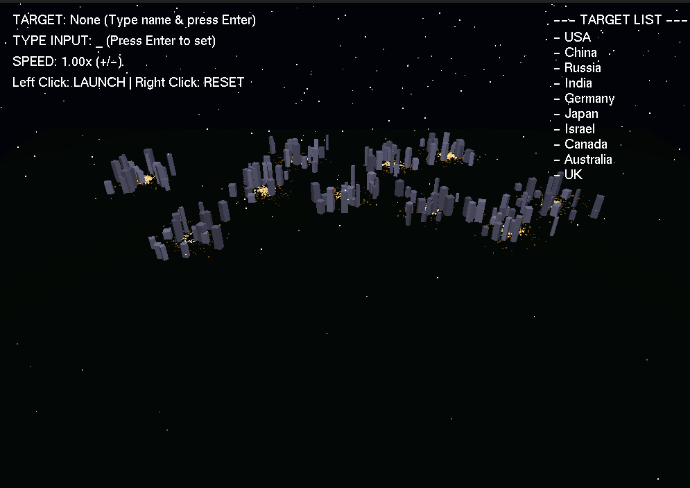

# Cinematic ICBM / Interplanetary Space Probe Simulator 🚀

A full-featured 3D cinematic simulation built with Python and OpenGL. This project simulates the launch, flight, and landing of a space exploration rocket traveling from a base on Earth to various outposts across the solar system.

## 🌟 Key Features

* **Interactive Target Selection:** Type the name of the destination directly into the interface to set coordinates.
* **Cinematic Camera System:** Features a multi-phase dynamic camera:
  * **Intro:** A rotating holographic globe view.
  * **Map View:** High-altitude satellite view of the alien terrain and outposts.
  * **Launch View:** Close-up on the rocket and launch pad during countdown.
  * **Flight View:** A tracking chase camera following the rocket mid-flight.
  * **Impact View:** Ground-level camera observing the landing shockwave and module interaction.
* **Realistic Physics & Mathematics:** Uses a 3D Cubic Bézier Curve to calculate the realistic parabolic flight trajectory.
* **Procedural Generation:** The alien terrain, stars, city lights, and station modules are generated procedurally, ensuring a unique look while maintaining core structure.
* **Dynamic Ground Deformation:** Features a true 3D terrain grid. Upon landing, a shockwave creates a visible physical crater in the terrain mesh.
* **Particle Systems:** Progressive engine fire, dynamic smoke during ignition, and a landing blast sphere.
* **Interactive UI:** On-screen Heads-Up Display (HUD) showing real-time altitude, distance, speed multipliers, and a countdown timer.

## 🛠️ Technologies Used

* **Language:** Python 3.x
* **Graphics Library:** PyOpenGL (OpenGL API for Python)
* **Window Management:** GLUT (OpenGL Utility Toolkit)

## 📸 Screenshots

| State | Screenshot |
| :--- | :--- |
| **Intro Screen** |  <br> *Rotating holographic globe showing global strategic command.* |
| **Target Selection** |  <br> *Satellite map view with typed input interface and target outposts.* |
| **Launch Phase** |  <br> *Close-up of the rocket on the launch pad during the 7-second ignition countdown.* |
| **Mid-Flight** |  <br> *Tracking camera following the rocket's parabolic trajectory.* |
| **Landing/Impact** |  <br> *Ground-level view of the energy shockwave expanding upon landing.* |
| **Crater Deformation** |  <br> *Visible 3D terrain deformation and flattened station modules post-landing.* |

## ⚙️ Installation & Setup

Follow these steps to run the simulation on your local machine.

### Prerequisites
You need to have Python installed along with the PyOpenGL libraries.

**1. Install Python**
Download and install Python from [python.org](https://www.python.org/downloads/).

**2. Install PyOpenGL**
Open your terminal or command prompt and run the following command to install the required OpenGL libraries:

```bash
pip install PyOpenGL PyOpenGL_accelerate
